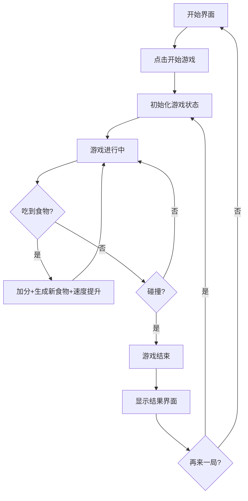

## 1. 产品概述

一个精美的网页版贪吃蛇游戏，玩家通过键盘方向键控制蛇移动，吃掉食物获得分数，避免撞到墙壁或自身。游戏具有复古像素艺术风格，配合流畅动画和音效，带来沉浸式游戏体验。

- 核心目标：提供一个有趣、易上手的休闲小游戏
- 目标用户：所有年龄段的休闲游戏玩家
- 产品价值：打发碎片时间，享受经典游戏乐趣

## 2. 核心功能

### 2.1 功能模块

1. **游戏主界面**：游戏画布、分数显示、等级显示、控制按钮
2. **开始界面**：游戏标题、开始按钮、游戏规则说明
3. **游戏结束界面**：最终得分、最高分、重新开始按钮
4. **游戏逻辑**：蛇移动控制、食物生成、碰撞检测、计分系统、难度递增

### 2.2 页面详情

| 页面名称 | 模块名称 | 功能描述 |
|-----------|-------------|---------------------|
| 开始界面 | 标题区域 | 游戏大标题，像素风格，带发光动画效果 |
| 开始界面 | 开始按钮 | 点击开始游戏，悬停有缩放动画 |
| 开始界面 | 规则说明 | 方向键控制、空格键暂停、吃食物得分 |
| 游戏界面 | 游戏画布 | Canvas渲染的游戏主区域，网格背景 |
| 游戏界面 | 信息栏 | 当前分数、当前等级、最高分 |
| 游戏界面 | 控制按钮 | 暂停/继续、重新开始 |
| 结束界面 | 结果展示 | 最终分数、历史最高分、游戏结束提示 |
| 结束界面 | 操作按钮 | 再来一局、返回首页 |

## 3. 核心流程

## 4. 用户界面设计

### 4.1 设计风格
- **主色调**：深黑色背景 (#0a0a0f) + 霓虹绿色 (#39ff14) + 霓虹粉色 (#ff00ff)
- **设计风格**：复古赛博朋克像素风，霓虹发光效果
- **字体**：Press Start 2P (像素字体) 用于标题，VT323 用于正文
- **按钮风格**：像素边框，发光悬停效果，点击有按压反馈
- **视觉效果**：蛇身渐变发光、食物脉冲动画、网格背景扫描线

### 4.2 页面设计概览

| 页面名称 | 模块名称 | UI元素 |
|-----------|-------------|-------------|
| 开始界面 | 标题区域 | 像素大字、霓虹发光、闪烁动画 |
| 开始界面 | 开始按钮 | 像素边框、绿色发光、悬停放大 |
| 开始界面 | 规则说明 | 半透明卡片、图标+文字说明 |
| 游戏界面 | 游戏画布 | 深色网格、蛇身渐变、食物脉冲 |
| 游戏界面 | 信息栏 | 分数/等级/最高分 三列布局 |
| 游戏界面 | 控制栏 | 暂停按钮、重开按钮 |
| 结束界面 | 结果弹窗 | 半透明背景、分数展示、按钮组 |

### 4.3 响应式
- 桌面端优先，画布居中显示
- 移动端自适应画布尺寸
- 支持触摸滑动控制（移动端）

### 4.4 音效设计
- 吃到食物：短促的"叮"声
- 游戏结束：低沉的"嗡"声
- 按钮点击：像素风格的点击音
