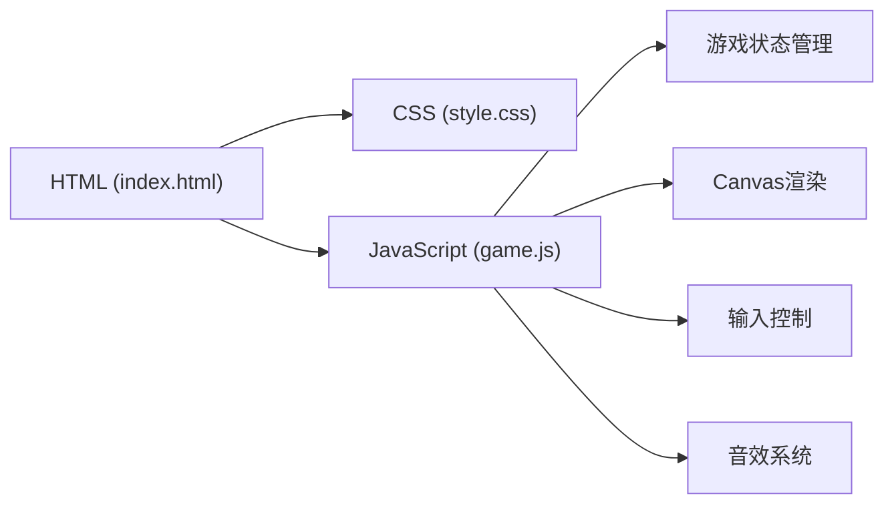

## 1. 架构设计



## 2. 技术说明

- **前端**：纯 HTML5 + CSS3 + 原生 JavaScript (ES6+)
- **渲染**：HTML5 Canvas 2D API
- **样式**：CSS3 动画、渐变、发光效果
- **音效**：Web Audio API (程序化生成音效，无需外部文件)
- **数据存储**：localStorage 保存最高分

## 3. 核心模块说明

### 3.1 游戏状态管理
- 状态枚举：MENU, PLAYING, PAUSED, GAME_OVER
- 核心数据：snake数组、food坐标、direction方向、score分数、level等级、speed速度

### 3.2 Canvas渲染模块
- 网格系统：20x20像素格子，画布尺寸根据屏幕自适应
- 渲染循环：requestAnimationFrame 驱动
- 视觉效果：蛇身渐变、食物脉冲、网格背景、发光效果

### 3.3 输入控制模块
- 键盘事件：方向键/WASD控制移动，空格键暂停/继续
- 触摸事件：移动端滑动手势支持

### 3.4 游戏逻辑模块
- 移动逻辑：每帧更新蛇头位置，身体跟随
- 碰撞检测：边界碰撞、自身碰撞、食物碰撞
- 食物生成：随机位置，避开蛇身
- 难度系统：每吃5个食物升一级，速度递增

### 3.5 音效模块
- 使用 Web Audio API 生成8-bit风格音效
- 三种音效：吃食物、游戏结束、按钮点击

## 4. 文件结构

```
/workspace
├── index.html          # 主页面
├── style.css           # 样式文件
└── game.js             # 游戏逻辑
```

## 5. 关键技术点

1. **Canvas性能优化**：只重绘变化区域，使用离屏Canvas缓存静态元素
2. **游戏循环**：固定时间步长的游戏循环，确保不同设备上速度一致
3. **防穿身逻辑**：方向改变时检查是否与当前方向相反
4. **食物生成算法**：随机生成后检查是否与蛇身重叠，重叠则重新生成
